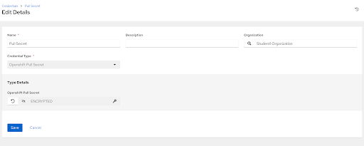
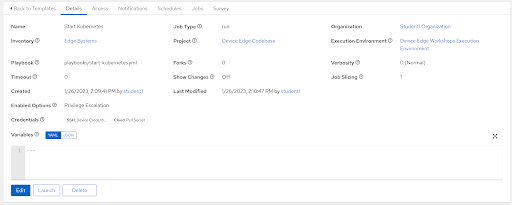

# Workshop Exercise 6.3 - Starting Up Kubernetes on Device Edge

## Table of Contents

* [Objective](#objective)
* [Step 1 - Creating the Bootstrap Automation](#step-1---creating-the-bootstrap-automation)
* [Step 2 - Adding Our Pull Secret to Ansible Controller](#step-2---adding-our-pull-secret-to-ansible-controller)
* [Step 3 - Creating a Job Template](#step-3---creating-a-job-template)
* [Step 4 - Running the Job Template](#step-4---running-the-job-template)
* [Solutions](#solutions)

## Objective

In this exercise, we'll write some automation to handle a prepratory actions towards getting Kubernetes running. Mainly, the goal is to assist working around a few bugs that currently exist. These should get cleaned up before GA, so these steps may change in the future.

Generally speaking, we need to accomplish the following:
1. Correct the CRI-O networking configuration
2. Fix a bug with pulling images
3. Push our pull secret
4. Start everything up

### Step 1 - Creating the Bootstrap Automation

Return to your code repo and create a file at `playbooks/files/microshift.conf` with the following contents:
```
[crio.runtime]
selinux = true
conmon = ""
conmon_cgroup = "pod"
cgroup_manager = "systemd"

[crio.network]

# The default CNI network name to be selected. If not set or "", then
# CRI-O will pick-up the first one found in network_dir.
# cni_default_network = ""

# Path to the directory where CNI configuration files are located.
network_dir = "/etc/cni/net.d/"

# Paths to directories where CNI plugin binaries are located.
plugin_dirs = [
        "/opt/cni/bin/",
        "/usr/libexec/cni/",
]

# the pull secret is mandatory for MicroShift builds on top of OpenShift
# for community builds on top of OKD, this setting has no effect
[crio.image]
global_auth_file="/etc/crio/openshift-pull-secret"
pause_image = "quay.io/openshift-release-dev/ocp-v4.0-art-dev@sha256:dd96c7e645b7cfaba393b8f486692ee76e44c307ebd4d12bb29145488cb31448"
```

The `network_dir` option ensures the appropriate configurations are picked up when starting the network provider.

Next, create a new playbook at `playbooks/bootstrap-kubernetes.yml` with the following contents:

```yaml
---

- name: configure and start microshift
  hosts:
    - all
  become: true
  pre_tasks:
    - name: copy crio config over
      ansible.builtin.copy:
        src: files/microshift.conf
        dest: /etc/crio/crio.conf.d/microshift.conf
    - name: push out pull secret
      ansible.builtin.copy:
        content: "{{ ocp_pull_secret }}"
        dest: /etc/crio/openshift-pull-secret
    - name: fix for https://github.com/cri-o/cri-o/issues/6197
      ansible.builtin.lineinfile:
        path: /etc/containers/policy.json
        regexp: '^.*keyPaths.*'
        line: '                    "keyPath": "/etc/pki/rpm-gpg/RPM-GPG-KEY-redhat-release"'
  tasks:
    - name: start microshift
      ansible.builtin.systemd:
        name: microshift
        state: started
        enabled: true
```
 

Here, we can see tasks to accomplish the goals of pushing out a corrected CRI-O config file, our pull secret, and fixing a bug. Once those have been completed, we can then start up microshift.

> **Note**
>
> Our pull secret will be stored securely in Ansible Controller instead of being committed to our repo.

Once these resources have been created, commit and push them up to the git repo.

### Step 2 - Adding Our Pull Secret to Ansible Controller

Similar to when we built our kickstart template, we're going to create a credential based on a custom credential type to store our pull secret.

In Ansible Controller, navigate to **Resources** > **Credentials** and click **Add**.

In the **Create New Credential** form, enter the following information:
<table>
  <tr>
    <th>Parameter</th>
    <th>Value</th>
  </tr>
  <tr>
    <td>Name</td>
    <td>Pull Secret</td>
  </tr>
  <tr>
    <td>Organization</td>
    <td>Student$(your-student-number) Organization</td>
  </tr>
  <tr>
    <td>Credential Type</td>
    <td>Openshift Pull Secret</td>
  </tr>
  <tr>
    <td>Openshift Pull Secret</td>
    <td>your-pull-secret</td>
  </tr>
</table>

Remember to hit **Save**.

> **Note**
>
> Your pull secret can be downloaded from [console.redhat.com](https://console.redhat.com/openshift/downloads).

### Step 3 - Creating a Job Template

> **Note**
>
> Be sure to sync your project in Controller before attempting to create this job template.

In the Controller WebUI. under **Resources** > **Templates**, select **Add** > **Add job template** and enter the following information:

<table>
  <tr>
    <th>Parameter</th>
    <th>Value</th>
  </tr>
  <tr>
    <td>Name</td>
    <td>Bootstrap Kubernetes</td>
  </tr>
  <tr>
    <td>Inventory</td>
    <td>Edge Systems</td>
  </tr>
  <tr>
    <td>Project</td>
    <td>Device Edge Codebase</td>
  </tr>
  <tr>
    <td>Execution Environment</td>
    <td>Device Edge Workshops Execution Environment</td>
  </tr>
  <tr>
    <td>Playbook</td>
    <td>playbooks/bootstrap-kubernetes.yml</td>
  </tr>
  <tr>
    <td>Credentials</td>
    <td><li>✓ Device Credentials</li></td>
    <td><li>✓ Pull Secret</li></td>
  </tr>
  <tr>
    <td>Limit</td>
    <td><li>✓ Prompt on launch</li></td>
  </tr>
   <tr>
    <td>Options</td>
    <td><li>✓ Privilege Escalation</li></td>
  </tr> 
</table>

Remember to click **Save**.

### Step 4 - Running the Job Template

Now that the job template has been created, click the **Launch** button if you are still within the _Bootstrap Kubernetes_ Job Template. Otherwise, click on the rocket ship on the Templates page to launch the job template. Enter your device name when prompted on the limits page. Monitor the output for any errors or issues. However, hopefully the job executes successfully.

As a reminder, the output of jobs can be reviewed on the **Jobs** tab.

### Solutions





---
**Navigation**

[Previous Exercise](../0.1-upgrade-rhde) | [Next Exercise](../6.4-app-definitions)

[Click here to return to the Workshop Homepage](../README.md)
