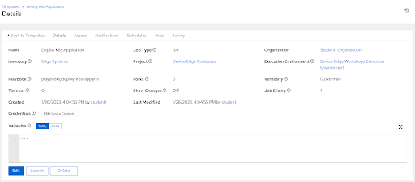

# Workshop Exercise 6.5 - Deploy Application

## Table of Contents

* [Objective](#objective)
* [Step 1 - Creating Our Playbook](#step-1---creating-our-playbook)
* [Step 2 - Creating a Job Template](#step-2---creating-a-job-template)
* [Step 3 - Running the Job Template](#step-3---running-the-job-template)
* [Step 4 - Manual Verification](#step-4---manual-verification)
* [Bonus Steps](#bonus-steps)
* [Solutions](#solutions)

## Objective

Now that we have the definitions for our application deployment, we're going to let Ansible do the heavy lifting.

The following automation will:
1. Slurp up the kubeconfig file from our edge device
2. Create a namespace for our applications
3. Push out our definitions

### Step 1 - Creating Our Playbook

Return to your code repo and create a new file at `playbooks/deploy-k8s-app.yml` with the following contents:


```yaml
---

- name: deploy application to k8s
  hosts:
    - all
  module_defaults:
    kubernetes.core.k8s:
      kubeconfig: /tmp/kubeconfig
      validate_certs: false
  pre_tasks:
    - name: slurp up kubeconfig
      ansible.builtin.slurp:
        path: /var/lib/microshift/resources/kubeadmin/kubeconfig
      register: kubeconfig_raw
      become: true
    - name: create kubeconfig
      delegate_to: localhost
      ansible.builtin.copy:
        content: "{{ (kubeconfig_raw['content'] | b64decode).replace('127.0.0.1', ansible_host) }}"
        dest: /tmp/kubeconfig
      delegate_to: localhost
    - name: allow API access
      ansible.posix.firewalld:
        port: 6443/tcp
        zone: public
        state: enabled
        immediate: true
        permanent: true
      become: true
  tasks:
    - name: make calls from localhost
      delegate_to: localhost
      block:
        - name: create namespace
          kubernetes.core.k8s:
            name: process-control
            kind: Namespace
            state: present
        - name: apply definitions
          kubernetes.core.k8s:
            namespace: process-control
            definition: "{{ lookup('file', yaml_file) | from_yaml }}"
          loop:
            - files/mqtt-service.yaml
            - files/mqtt-deployment.yaml
            - files/simulate-deployment.yaml
            - files/control-deployment.yaml
            - files/ui-service.yaml
            - files/ui-deployment.yaml
          loop_control:
            loop_var: yaml_file
```


This playbook handles grabbing the kubeconfig, setting the correct cluster address, then deploys our application.

Remember to commit and push your new playbook up to the git repo.


### Step 2 - Creating a Job Template

> **Note**
>
> Be sure to sync your project in Controller before attempting to create this job template.
> Make sure also to disable edge device firewall to allow calling k8s apis

In the Controller WebUI. under **Resources** > **Templates**, select **Add** > **Add job template** and enter the following information:

<table>
  <tr>
    <th>Parameter</th>
    <th>Value</th>
  </tr>
  <tr>
    <td>Name</td>
    <td>Deploy K8s Application</td>
  </tr>
  <tr>
    <td>Inventory</td>
    <td>Edge Systems</td>
  </tr>
  <tr>
    <td>Project</td>
    <td>Device Edge Codebase</td>
  </tr>
  <tr>
    <td>Execution Environment</td>
    <td>Device Edge Workshops Execution Environment</td>
  </tr>
  <tr>
    <td>Playbook</td>
    <td>playbooks/deploy-k8s-app.yml</td>
  </tr>
  <tr>
    <td>Credentials</td>
    <td><li>✓ Device Credentials</li></td>
  </tr>
  <tr>
    <td>Limit</td>
    <td><li>✓ Prompt on launch</li></td>
  </tr>
</table>

Remember to click **Save**.

### Step 3 - Running the Job Template

Now that the job template has been created, click the **Launch** button if you are still within the _Deploy K8s Application_ Job Template. Otherwise, click on the rocket ship on the Templates page to launch the job template. Enter your device name when prompted on the limits page. Monitor the output for any errors or issues. However, hopefully the job executes successfully.

As a reminder, the output of jobs can be reviewed on the **Jobs** tab.

### Step 4 - Manual Verification

In lieu of completing the [Bonus Steps](#bonus-steps) below, a few manual steps can be taken to verify the application is up and functioning:
1. SSH to the edge system using the IP address from the `ansible_host` variable in Ansible Controller
2. Copy the kubeconfig to the user's home directory: `sudo cp /var/lib/microshift/resources/kubeadmin/kubeconfig .kubeconfig`
3. Download the `oc` cli tool: `curl https://mirror.openshift.com/pub/openshift-v4/x86_64/clients/ocp/stable/openshift-client-linux.tar.gz --output openshift-client-linux.tar.gz`
4. Extract the `oc` CLI tool: `tar -xzvf openshift-client-linux.tar.gz`
5. Set the kubeconfig env var: `export KUBECONFIG=~/.kubeconfig`
6. Check deployments: `./oc get deployments`

Assuming everything is working, 4 deployments should exist within the `process-control` namespace.

In addition, the playbook above could be modified to include these steps or similar steps to get the status of the deployed application.

### Bonus Steps

For some extra practice, an additional step must be taken to access the application.

1. Since we did not set up an OpenShift Route (or DNS), add a Route definition, adjust the deployment playbook, re-run it, and configure your personal device's DNS settings (one option is to add a line in `/etc/hosts`), then attempt to access the application.
2. Use the `oc` CLI utility and the `port-forward` subcommand to create a tunnel to the application and test connectivity.

### Solutions



---
**Navigation**

[Previous Exercise](../6.4-app-definitions)

[Click here to return to the Workshop Homepage](../README.md)
