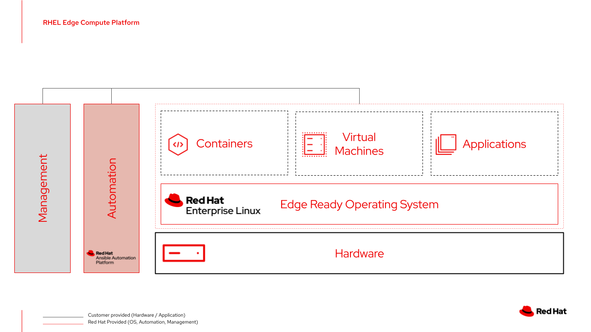

# Red Hat Device Edge Workshop - Any Workload, 120 Minutes Edition

This workshop focuses on deploying various workloads to a Device Edge endpoint, focusing on ease of updating the image to support the workload type and leveraging automation to deploy the workload. Due to the smaller timeframe of this lab, most setup steps have been completed prior to the lab - see the lab diagram for more info. The first excercise will focus on investigating the existing components.

After finishing this lab you are ready to start using Red Hat Device Edge to run your workloads.

## Table of Contents

- [Red Hat Device Edge Workshop - Any Workload, 120 Minutes Edition](#red-hat-device-edge-workshop---any-workload,-120-minutes-edition)
  - [Table of Contents](#table-of-contents)
  - [Presentations](#presentations)
  - [Time planning](#time-planning)
  - [Lab Diagram](#lab-diagram)
  - [Section 1 - Investigating the Lab Environment](#section-1---investigating-the-lab-environment)
  - [Section 2 - Initial Image Creation and Device Installation](#section-2---initial-image-creation-and-device-installation)
  - [Section 3 - Deploying a Base-Metal Workload](#section-3---deploying-a-bare---metal-workload)
  - [Section 4 - Deploying a Containerized Workload](#section-4---deploying-a-containerized-workload)
  - [Section 5 - Deploying a Kubernetes Native Application](#section-5---deploying-a-kubernetes-native-application)

## Presentations

The exercises are self explanatory and guide the participants through the entire lab. All concepts are explained when they are introduced.

Have a look at a general deck about Red Hat's Edge strategy:
[Red Hat Edge Compute Platform](../../decks/rh_edge_compute_platform.pdf)

Also, have a look at our Ansible Best Practices Deck:
[Ansible Best Practices](../../decks/ansible_best_practices.pdf)

## Time planning

The time required to do the workshops strongly depends on multiple factors: the number of participants, how familiar those are with Linux in general and how much discussions are done in between.

Having said that, this workshop is built to take roughly 2 hours.

## Lab Diagram

## Section 1 - Investigating the Lab Environment

* [Exercise 1.1 - Preflight Checks](1.1-preflight)
* [Exercise 1.2 - Investigating Ansible Controller](1.2-controller-intro)
* [Exercise 1.3 - Investigating Source Control](1.3-source-control-intro)
* [Exercise 1.4 - Investigating Your Edge Device](1.4-device-intro)
* [Exercise 1.5 - Investigating the Example Workload](1.5-application-info)
* [Exercise 1.6 - Gathering Networking Information](1.6-network-info)
* [Exercise 1.7 - Cloning Your Code Repository](1.7-coding-intro)

## Section 2 - Setting Up for Zero Touch Provisioning

* [Exercise 2.1 - Creating a Provision Workflow](2.1-provisioning-workflow)
1. Create a provisioning workflow in controller
2. Create a kickstart template
3. Write a playbook to template out kickstart
4. Run kickstart playbook
5. Embedding the kickstart into a boot ISO
* [Exercise 2.1 - Introduction to infra.osbuild Collection](2.1-infra.osbuild-intro)

## Section 3 - Kickstarting a Device

1. Edge device | boot from flash drive
2. Edge hypervisor | upload iso
3. Edge hypervisor | create VM in Cockpit
4. Edge hypervisor | boot and provision VM
* [Exercise 2.5 - Red Hat Device Edge OS Investigation](2.5-os-intro)

## Section 3 - Deploying a Base-Metal Workload

* [Exercise 3.1 - Updating Image for a Bare Metal Application](3.1-base-metal-image)
* [Exercise 3.2 - Automated Device Update](0.1-update-device)
* [Exercise 3.3 - Create Automation to Deploy Application](3.3-bare-metal-app-automation)
* [Exercise 3.4 - Deploy Application](3.4-deploy-bare-metal-app)

## Section 4 - Deploying a Containerized Workload

* [Exercise 4.1 - Updating Image for Bare Metal Deployment](4.1-podman-image)
* [Exercise 3.2 - Automated Device Update](0.1-update-device)
* [Exercise 4.3 - Leveraging redhat.rhel_system_roles.podman Role](4.3-podman-role)
* [Exercise 4.4 - Deploy Application](4.4-deploy-containerized-app)

## Section 5 - Deploying a Kubernetes Native Application

* [Exercise 5.1 - Adding Device Edge Functunality-to the Image](5.1-add-device-edge)
* [Exercise 3.2 - Automated Device Update](0.1-update-device)
* [Exercise 5.3 - Investigate New Device Edge Functionality](5.3-device-edge-features)
* [Exercise 5.4 - Create Automation to Deploy Application](5.4-device-edge-app-deployment)
* [Exercise 5.5 - Deploy Application](2.4-deploy-to-device-edge)
