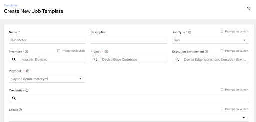

# Workshop Exercise 6.4 - Creating a Job Template for the CIP Playbook

## Table of Contents

* [Objective](#objective)
* [Step 1 - Syncing Our Project](#step-1---syncing-our-project)
* [Step 2 - Creating a Job Template](#step-2---creating-a-job-template)
* [Solutions](#solutions)

## Objective

In this exercise, we'll sync our project and create a job template for our automation.

### Step 1 - Syncing Our Project

Return to the Ansible Controller WebUI and navigate to **Resources** > **Projects**. Locate the project named **Device Edge Codebase** and click the **Sync Project** button on the right hand side of the page.

For reference, this is the sync button:

After clicking the sync button, the WebUI will show the project syncing and then a success under the **Status** column.

### Step 2 - Creating a Job Template

In the Controller WebUI. under **Resources** > **Templates**, select **Add** > **Add job template** and enter the following information:

<table>
  <tr>
    <th>Parameter</th>
    <th>Value</th>
  </tr>
  <tr>
    <td>Name</td>
    <td>Run Motor</td>
  </tr>
  <tr>
    <td>Inventory</td>
    <td>Industrial Devices</td>
  </tr>
  <tr>
    <td>Project</td>
    <td>Device Edge Codebase</td>
  </tr>
  <tr>
    <td>Execution Environment</td>
    <td>Device Edge Workshops Execution Environment</td>
  </tr>
  <tr>
    <td>Playbook</td>
    <td>playbooks/run-motor.yml</td>
  </tr>
</table>

Remember to click **Save**.

### Solutions

---
**Navigation**

[Previous Exercise](../6.3-tags-playbook) | [Next Exercise](../6.5-run-cip-automation)

[Click here to return to the Workshop Homepage](../README.md)

