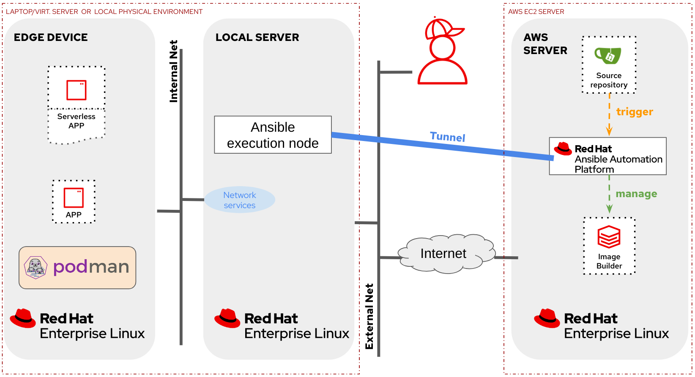

# Red Hat Device Edge GitOps demo

In this technical demo, we showcase the power of Ansible Automation Platform and Event-Driven Automation in orchestrating and managing the Red Hat Device Edge ecosystem (RHEL and Microshift). Embracing the GitOps methodology, our demonstration highlights how organizations can efficiently manage both the platform and applications by treating infrastructure as code and leveraging version-controlled repositories. 

GitOps principles enable a seamless and auditable approach to infrastructure and application management, offering numerous benefits. By centralizing configuration in Git repositories, organizations gain versioning, change tracking, and collaboration advantages. The demo illustrates how Ansible, a powerful automation tool, combined with GitOps practices, ensures consistency, traceability, and repeatability in the deployment and configuration of Red Hat Device Edge components.

## Table of Contents

- [Red Hat Device Edge GitOps demo](#red-hat-device-edge-gitops-demo)
  - [Table of Contents](#table-of-contents)
  - [Demo duration](#demo-duration)
  - [Lab Architecture](#lab-architecture)
  - [Required connectivity](#required-connectivity)
  - [Recommended Hardware](#recommended-hardware)
  - [Pre-recorded video](#pre-recorded-video)
  - [Preparation - Deployment and Pre-Flight Checks](#preparation---deployment-and-pre-flight-checks)
  - [Summary and demo step guide](#summary-and-demo-step-guide)
  - [Introduction](#introduction)
  - [Section 1 - Creating RHEL Images the GitOps way](#section-1---creating-rhel-images-the-gitops-way)
  - [Section 2 - Automated device onboarding](#section-2---automated-device-onboarding)
  - [Section 3 - Consistent edge device configuration at scale](#section-3---consistent-edge-device-configuration-at-scale)
  - [Section 4 - Edge computing APPs lifecycle management](#section-4---edge-computing-apps-lifecycle-management)
  - [Section 5 - Bulletproof system upgrades](#section-5---bulletproof-system-upgrades)
  - [Closing](#closing)

## Demo duration

The demo can take between 90 and 120 minutes (closer to 120 min.) with no breaks. If you have time, a break after each main section is recommended. 

## Lab Architecture

This lab has two different setups:

1. In the "local" lab architecture you will deploy a Server with all services (AAP, Gitea, Image-builder, Network services, ...) and the Edge device locally, either in your laptop/virtualization server or in your local physical environment (when using physical servers)
2. In the "external" lab architecture option you will deploy a Server running the main services (AAP, Gitea, Image-builder) on AWS (no other cloud providers have been configured on the Ansible playbooks that deploy this lab) and additionally, you will also deploy a local server (Ansible execution node and local Network services) and the Edge Device locally (again, either in VMs or physical servers).

This is the diagram for the "local" lab architecture:

In the following diagram you can see the "external" lab architecture:

## Required connectivity
Internet Connection with access to Red Hat sites, GitHub, Slack and Quay.io.

The external lab architecture has been designed so you can deploy it where you don't have access to the network to re-configure NAT entries. This is done (for demo pruposes, do not use at production please) using a reverse SSH tunnel between the local and the remote server, so be sure that outgoing SSH connections are allowed in the Venue firewall if using this setup.

## Recommended Hardware
If you plan to use VMs you just need enough free resources in your laptop/server (>6vCPUs, >14GB RAM, >50GB disk)

If you use physical hardware you probably will need:
+ Two (mini)servers, one of them with (4vCPUs, 16GB RAM, 50GB+ disk and two network interfaces)
+ USB Keyboard (I use one of [this USB RFID mini keyboards](https://www.amazon.es/dp/B07RQBRRR7?psc=1&ref=ppx_yo2ov_dt_b_product_details), but be sure that it does not use just Bluetooth)
+ Video Cable (and HDMI - DisplayPort adapter if needed) and external Monitor to show boot console. If you don't want to use an external screen you can also use a [Video Capture card like this one](https://www.amazon.es/dp/B0CLNHT29F?ref=ppx_yo2ov_dt_b_product_details&th=1) that I use that can show the physical device video output as a video input (camera) in your laptop.
+ Access Point or Router if you don't have a cabled connection to Internet
+ Network Switch if you Access Point / Router does not have at least 2 free interfaces
+ At least 3 RJ45 cables
+ Depending on your laptop you will need aditional adapters (ie. to provide RJ45 interface). Also in certain venues where use HDMI over RJ45 sometimes you could find that your Linux machine does not mirror the screen correctly when using direct HDMI cable, but it works if you connect it to an HDMI port in a USB C adapter (???), so I finally got [this adapter that has both RJ45 and HDMI output](https://www.amazon.es/dp/B0CBVDRPZD?ref=ppx_yo2ov_dt_b_product_details&th=1).
 

## Pre-recorded video

You can [take a look at this video](https://youtu.be/XCtfy7AqLLY) where you can see the flow of the demo. In that case, the lab local architecture was used.

  >**Note**
  >
  > The demo steps below have some differences with the video due to the addition of Microshift. First the order of the sections `Consistent edge device configuration at scale` and `Edge computing APPs lifecycle management` are swapped in order to give more time to Microshift to start. Second, in the section `Edge computing APPs lifecycle management` additional steps relative to Microshift were introduced.

## Preparation - Deployment and Pre-Flight Checks

You can find the steps to deploy the lab here:

* [Lab deployment](0.1-deployment)

## Summary and demo step guide

This is the summarized list of the steps (below you will find the detailed description in each section):

* [Summary and demo step guide](s0-summary.md)

## Introduction

## Section 1 - Creating RHEL Images the GitOps way

* [Creating RHEL Images the GitOps way](s1-creating_RHEL_images.md)

## Section 2 - Automated device onboarding

* [Automated device onboarding](s2-automated-onboarding.md)

## Section 3 - Consistent edge device configuration at scale

* [Consistent edge device configuration at scale](s3-consistent_configuration.md)

## Section 4 - Edge computing APPs lifecycle management

When we consider the applications used in edge computing scenarios, we find a wide variety of options. However, for such applications, we need the platform to meet at least three key requirements:

* Resource Efficiency: Edge devices often have limited hardware resources, so applications must consume as few resources as possible.
* Automated Lifecycle Management: Applications should be fully automated, including upgrades.
* Self-Healing: Applications should be resilient, and capable of recovering from critical failures.

While similar capabilities might exist in public clouds or data centers, the hardware used in edge computing solutions is different. Due to hardware limitations, deploying a full Kubernetes cluster, which is common in data centers for serverless applications, might not be feasible in these scenarios. Here, we must consider trade-offs between capabilities and hardware resources consumed by the platform. 

Thanks to Red Hat Device Edge we can choose between two different approaches to deploy and manage APPs at the Edge taking those constraints into consideration while deploying our containerized applications

* Use just Podman and Systemd

* Use Microshift (Kubernetes API), an upstream kubernetes project that includes some of the OpenShift APIs designed to be executed in small hardware footprint devices.

This section is divided in two. In the first part, we will manage applications that are deployed with just Podman/Systemd (no Kubernetes at all) and during the second one we will introduce Kubernetes workloads by using `Microshift`.

**IMPORTANT**

We will be accessing the Apps deployed on the edge device from our laptop. This device is connected to the "internal network" which is isolated (take a look again to the lab diagram) so by default that won't be possible. We have two solutions here, we can connect our laptop to the isolated environment or we can use the SOCKS server that is pre-installed in the local server on port `1080`.

By configuring the edge local server as SOCKS server in our Web Browser we will be using that server as "jump host" and we will get access to the edge device without having to move our laptop to the isolated network. I use to use two Browsers, the main (Chrome) where I show AAP, Gitea and others; and the secondary (Firefox) where I configure the SOCKS server and where I show the APPs deployed in the edge device. This is an example configuration for Firefox (192.168.140.202 is the external IP of the local edge server in this case):

  >**Note**
  >
  > Remember to run the [Pre-flight checks](0.1-deployment/README.md#pre-flight-checks) which involves the SOCKS server testing before running the demo/workshop.

### APPs with Podman and Systemd

The steps to show the application deployment and lifecycle management using Podman can be found here:

* [Edge computing APPs lifecycle management - APPs with Podman and Systemd](s4-app-lifecycle-podman.md)

We have shown how, thanks to Podman and Systemd, it's possible to include complex deployments, like serverless services with auto-update and self-healing, on small hardware footprint devices without needed additional layers such as the Kubernetes API. 

This means you don't have to sacrifice useful features when using small hardware footprint devices. Podman makes the most out of your hardware.

### APPs with Microshift

Now an idea of how you could manage Microshift using Ansible Collections through the Ansible Automation Platform:

**IMPORTANT**

In this demo/workshop we are bringing some ideas about how to build a gitops-like environment using just Ansible Automation Platform (AAP). This is a great approach when using applications deployed using Podman, but when you introduce a Kubernetes API it's even better to complement the AAP with the use of any of the existing GitOps tools (ie. ArgoCD) or Kubernetes API-focused management products, for example, Red Hat Advance Cluster Management (ACM). In the specific case of Microshift, at this moment (January'24) the management of applications on top of Microshift using ACM is a technical preview feature and in the near future Microshift will be supporting dedicated GitOps tools.

* [Edge computing APPs lifecycle management - APPs with Microshift](s4-app-lifecycle-microshift.md)

We have seen that in addition to what we can get with Podman, we can also make use of the Kubernetes API in Red Hat Device Edge (This flexibility is even greater if you think that you can also deploy traditional non-containerized applications as part of the Red Hat Device Edge images, although this is not covered in this demo/workshop).

In summary, it's all about deciding where to place your workload and how you want to run it.

## Section 5 - Bulletproof system upgrades

* [Bulletproof system upgrades](s5-system-upgrades.md)

## Closing
TBD

