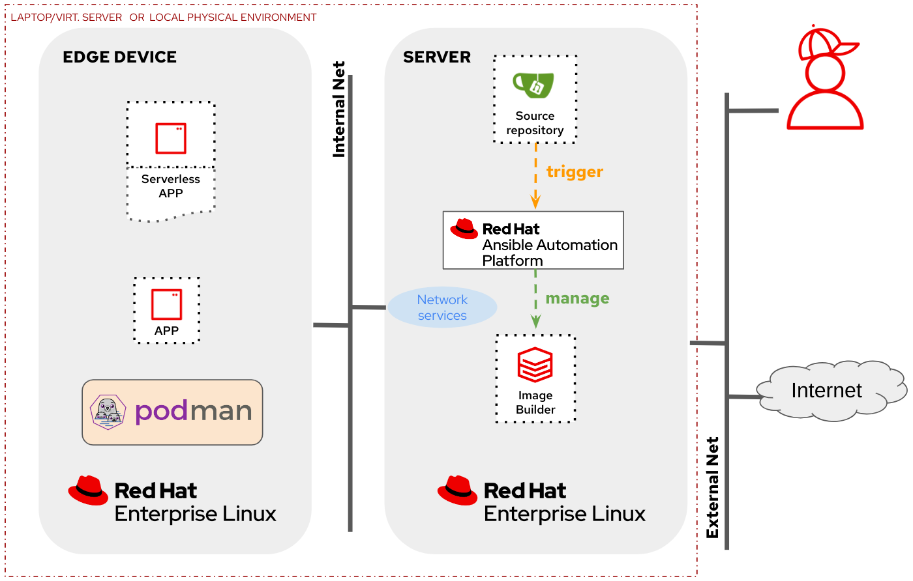

# Red Hat Device Edge GitOps demo

In this technical demo, we showcase the power of Ansible Automation Platform and Event-Driven Automation in orchestrating and managing the Red Hat Device Edge ecosystem (RHEL and Microshift). Embracing the GitOps methodology, our demonstration highlights how organizations can efficiently manage both the platform and applications by treating infrastructure as code and leveraging version-controlled repositories. 

GitOps principles enable a seamless and auditable approach to infrastructure and application management, offering numerous benefits. By centralizing configuration in Git repositories, organizations gain versioning, change tracking, and collaboration advantages. The demo illustrates how Ansible, a powerful automation tool, combined with GitOps practices, ensures consistency, traceability, and repeatability in the deployment and configuration of Red Hat Device Edge components.

## Table of Contents

- [Red Hat Device Edge GitOps demo](#red-hat-device-edge-gitops-demo)
  - [Table of Contents](#table-of-contents)
  - [Demo duration](#demo-duration)
  - [Lab Architecture](#lab-architecture)
  - [Required connectivity](#required-connectivity)
  - [Recommended Hardware](#recommended-hardware)
  - [Pre-recorded video](#pre-recorded-video)
  - [Preparation - Deployment and Pre-Flight Checks](#preparation---deployment-and-pre-flight-checks)
  - [Section 1 - Creating RHEL Images the GitOps way](#section-1---creating-rhel-images-the-gitops-way)
  - [Section 2 - Automated device onboarding](#section-2---automated-device-onboarding)
  - [Section 3 - Edge computing APPs lifecycle management](#section3---edge-computing-apps-lifecycle-management)
  - [Section 4 - Consistent edge device configuration at scale](#section-4---consistent-edge-device-configuration-at-scale)
  - [Section 5 - Bulletproof system upgrades](#section-5---bulletproof-system-upgrades)
  - [Closing](#closing)

## Demo duration

The demo can take between 90 and 120 minutes (closer to 120 min.) with no breaks. If you have time, a break after each main section is recommended. 

## Lab Architecture

This lab has two different setups:

1. In the "local" lab architecture you will deploy a Server with all services (AAP, Gitea, Image-builder, Network services, ...) and the Edge device locally
2. In the "external" lab architecture option you will deploy a Server running the main services (AAP, Gitea, Image-builder) on AWS and locally you will deploy an additional server (Ansible execution node and local Network services) and the Edge Device.

This is the diagram for the "local" lab architecture:

In the following diagram you can see the "external" lab architecture:

## Required connectivity
Internet Connection with access to Red Hat sites, GitHub, Slack and Quay.io.

The external lab architecture has been designed so you can deploy it where you don't have access to the network to re-configure NAT entries. This is done (for demo pruposes, do not use at production please) using a reverse SSH tunnel between the local and the remote server, so be sure that outgoing SSH connections are allowed in the Venue firewall if using this setup.

## Recommended Hardware
If you plan to use VMs you just need enough free resources in your laptop/server (>6vCPUs, >14GB RAM, >50GB disk)

If you use physical hardware you probably will need:
+ Two (mini)servers, one of them with (4vCPUs, 16GB RAM, 50GB+ disk and two network interfaces)
+ USB Keyboard (I use one of [this USB RFID mini keyboards](https://www.amazon.es/dp/B07RQBRRR7?psc=1&ref=ppx_yo2ov_dt_b_product_details), but be sure that it does not use just Bluetooth)
+ Video Cable (and HDMI - DisplayPort adapter if needed) and external Monitor to show boot console. If you don't want to use an external screen you can also use a [Video Capture card like this one](https://www.amazon.es/dp/B0CLNHT29F?ref=ppx_yo2ov_dt_b_product_details&th=1) that I use that can show the physical device video output as a video input (camera) in your laptop.
+ Access Point or Router if you don't have a cabled connection to Internet
+ Network Switch if you Access Point / Router does not have at least 2 free interfaces
+ At least 3 RJ45 cables
+ Depending on your laptop you will need aditional adapters (ie. to provide RJ45 interface). Also in certain venues where use HDMI over RJ45 sometimes you could find that your Linux machine does not mirror the screen correctly when using direct HDMI cable, but it works if you connect it to an HDMI port in a USB C adapter (???), so I finally got [this adapter that has both RJ45 and HDMI output](https://www.amazon.es/dp/B0CBVDRPZD?ref=ppx_yo2ov_dt_b_product_details&th=1).
 

## Pre-recorded video

You can [take a look at this video](https://youtu.be/XCtfy7AqLLY) where you can see the flow of the demo. In that case, the lab local architecture was used.

## Preparation - Deployment and Pre-Flight Checks

You can find the steps to deploy the lab here:

* [Lab deployment](0.1-deployment)

## Section 1 - Creating RHEL Images the GitOps way
TBD

## Section 2 - Automated device onboarding
TBD

## Section 3 - Edge computing APPs lifecycle management
TBD

## Section 4 - Consistent edge device configuration at scale
TBD

## Section 5 - Bulletproof system upgrades
TBD

## Closing
TBD

