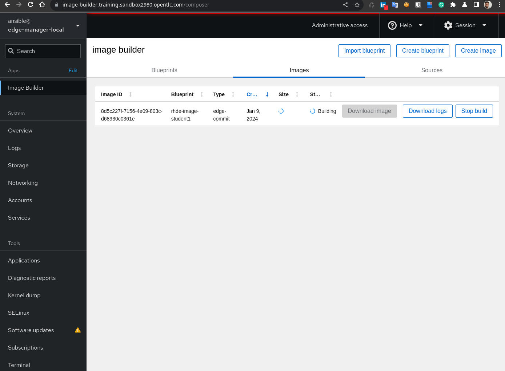
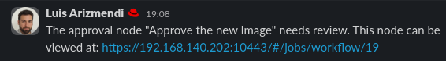
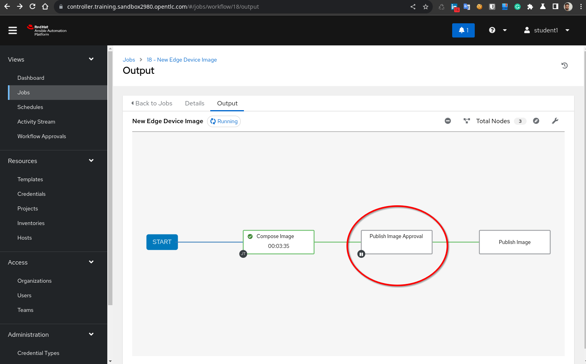
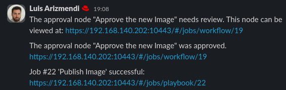

# Section 1 - Creating RHEL Images the GitOps way

1. Open Gitea in `http://gitea.{{ ec2_name_prefix }}.{{ workshop_dns_zone }}` and use `student1` with the `{{ admin_password }}` password.

  >**Note**
  >
  > Change those variables with the values that you can find in the `extra_vars.yml` file that you used for the deployment.

You will see three repositories: `device-edge-automation`, with the AAP ansible playbooks, `device-edge-configs`, with the Operating System and APP configurations that we will use in Sections 3 and 4, and the one containing the image descriptors: `device-edge-images`.

The `device-edge-images` repository has three files:

* `production-image-definition.yml`: This is the descriptor that will generate the image Blueprint and commit that Blueprint in the Image Builder service to generate the new Red Hat Device Edge image. The file is actually the vars for the [Osbuild Composer Ansible Collection](https://github.com/redhat-cop/infra.osbuild).

* `production-image-deploy.yml`: This is a workaround to save some during Section 5. If you want to know more now about this just take a look at  [TIP: Reducing the demo/workshop time by pre-creating images in advance](s5-system-upgrades.md#tip-reducing-the-demoworkshop-time-by-pre-creating-images-in-advance). This is not needed at this moment.

* `production-kickstart.ks`: In this demo/workshop the onboarding is performed by running post-deployment steps launched by a Kickstart file. FIDO Device Onboarding Specification could be used for a more secure onboarding experience but that's out of the scope of the demo. If you want to play with FDO you can follow the [Secure Edge device onboarding with RHEL and FDO](https://github.com/luisarizmendi/edge-demos/blob/main/demos/rhel-fdo-onboarding/README.md) self-paced workshop or build the [Red Hat Device Edge - FDO Secure Onboarding and the Realtime Kernel](https://github.com/redhat-manufacturing/device-edge-workshops/tree/main/exercises/rhde_fdo_rtk) lab.


Besides the main files, you will also find an `examples` folder where you have image descriptors and kickstart files that can be used.


2. Open the Gitea repository Settings (top right, under the "fork" number). Then jump into the "Webhooks" section. There you will see that there is a webhook configured that, when pushing changes into the repository, will contact the Event Driven Automation (EDA) service, which will be listening and if certain paramenters are fullfil in its filters, it will lauch Jobs and Workflows directly into Ansible Automation Platform (AAP).


3. Open AAP in `http://controller.{{ ec2_name_prefix }}.{{ workshop_dns_zone }}` and use `student1` with the `{{ admin_password }}` password. Navigate to "Jobs" and keep that page visible while performing the step below, so you can see how the Jobs are launched automatically after modifying files in Gitea.


4. Now it's time to modify the files so a new image build is automatically launched right after the push the changes into the Gitea repository. In other Sections of this lab we will be modifying the files directly in Gitea for simplicity, although you can also clone the repository in your laptop and push changes from there. 

  >**Note**
  >
  > This first time we will take this approach (clone the repo in our laptop) because we will need to modify two files (`production-image-definition.yml` and `production-kickstart.ks`) to prepare and publish our image. If we were using the Gitea Web to modify the files we will need to do it sequentially (you cannot modify two files and push the changes, you need to modify-push and then modify-push). That would mean that we will activate the " New Edge Device Image" Workflow Job (which involves "Compose Image" and "Publish Image" Jobs as we will see below ) when we modify the `production-image-definition.yml` and we will trigger again the "Publish Image" Job when we modify the `production-kickstart.ks` file.


In this demo we will need to enable Microshift so we will be using the `production-microshift-blueprint-v1.yml` (`v2` and `v3` are for Section 5 of the demo) and `production-microshift-kickstart.ks` files that you can find in the `examples` directory. We just need to clone the repo, copy/paste the files and push the changes:

  >**Note**
  >
  > Now we will just copy the example files. We will review the contents while the image is being generated to fill that time with something useful.

* Clone the repository in your laptop (use same user and password than in Gitea and AAP):

```bash
larizmen@hal9k:/tmp/demo$ git clone https://gitea.{{ ec2_name_prefix }}.{{ workshop_dns_zone }}/student1/device-edge-images
Cloning into 'device-edge-images'...
Username for 'https://gitea.{{ ec2_name_prefix }}.{{ workshop_dns_zone }}': student1
Password for 'https://student1@{{ ec2_name_prefix }}.{{ workshop_dns_zone }}': 
remote: Enumerating objects: 18, done.
remote: Counting objects: 100% (18/18), done.
remote: Compressing objects: 100% (18/18), done.
remote: Total 18 (delta 10), reused 0 (delta 0), pack-reused 0
Receiving objects: 100% (18/18), 8.79 KiB | 4.39 MiB/s, done.
Resolving deltas: 100% (10/10), done.

```

* Move into the directory and copy the files from the examples:

```bash
larizmen@hal9k:/tmp/demo$ cd device-edge-images/
larizmen@hal9k:/tmp/demo/device-edge-images$ cp examples/production-microshift-blueprint-v1.yml production-image-definition.yml 
larizmen@hal9k:/tmp/demo/device-edge-images$ cp examples/production-microshift-kickstart.ks production-kickstart.ks 
```

* Push changes

```bash
larizmen@hal9k:/tmp/demo/device-edge-images$ git add .

larizmen@hal9k:/tmp/demo/device-edge-images$ git commit -m "New Microshift image"
[main 98a20d7] New Microshift image
 2 files changed, 2 insertions(+), 1 deletion(-)

larizmen@hal9k:/tmp/demo/device-edge-images$ git push
Enumerating objects: 7, done.
Counting objects: 100% (7/7), done.
Delta compression using up to 12 threads
Compressing objects: 100% (4/4), done.
Writing objects: 100% (4/4), 359 bytes | 359.00 KiB/s, done.
Total 4 (delta 3), reused 0 (delta 0), pack-reused 0
remote: . Processing 1 references
remote: Processed 1 references in total
To https://gitea.{{ ec2_name_prefix }}.{{ workshop_dns_zone }}/student1/device-edge-images
   78573ec..98a20d7  main -> main

```

5. Right after the push, you will see in the AAP Jobs page a new "New Edge Device Image" Workflow and a "Compose Image" Job (which is actually launched by the "New Edge Device Image" Workflow as first step). 

Open the "New Edge Device Image" Workflow and show the three steps:

* "Compose Image": Build the image using the Image Builder service using the values provided in the files that we modified.

* "Publish Image Approval": We introduced an approvation as part of the workflow, so you can create an image without "making it accessible" by the edge devices

* "Publish Image": This will publish the image so the edge devices can use it.


6. Open the Image Builder Cockpit Web console at `https://image-builder.{{ ec2_name_prefix }}.{{ workshop_dns_zone }}/composer`. Log in with the `ànsible` user and the `{{ admin_password }}` password located in the `extra_var.yaml` file. 

You can go to "Image Builder" and click on "Images" so you can see how the new image is being created.



  >**Note**
  >
  > You might need to enable the privilege view (`sudo`) by clicking in "Limited access" lock icon on the top right. You might also need to click on the "Start Socket" and then refresh your Web Browser.


7. Go to Gitea again and review the `production-kickstart.ks` and `production-image-definition.yml` that we used to create the image. You can mention this about the files:

For `production-image-definition.yml`:

* Microshift is enabled in the image. The Microshift package needs the admin to enable two additional repositories. This can be done at the Image Builder level or when you create the image by introducing those repositories under the `builder_rhsm_repos`, so something like this:


```bash
...
builder_skip_repo: true
builder_rhsm_repos:
- "rhocp-4.14-for-rhel-9-x86-rpms"
- "enable fast-datapath-for-rhel-9-x86-rpms"
builder_compose_pkgs:
...
```

The Ansible playbooks that installed the lab already enabled these repositories at the Image Builder level so that's why those are not defined in the image descriptor like in the example shown above.

* An `ansible` user will be created with the defined password. That user will be in the sudoers list

* The image descriptor also enables by default the Systemd unit for Microshift


For `production-kickstart.ks`:

* The kickstart will launch the OSTree image deployment as you can see in the `ostreesetup` line at the beginning. That line points to where the OSTRee image will be published, in our case `http://ostree-repo.{{ ec2_name_prefix }}.{{ workshop_dns_zone }}/student-repos/student1/repo`

* It will create a configuration file for Microshift and inject the `pull-secret` in the right location

  >**Note**
  >
  > This is a great opportunity to show the benefit of using FIDO FDO instead of Kickstarts for onboarding the devices, since with FDO there will be no secrets delivered to the systems until they are authenticated with an external server (also preventing someone to steal the device and have access to those secrets). 

* For testing the demo environment we include an application pre-defined in Microshift. We used a Microshift capability that makes it possible to locate descriptors that can be customized with Kustomize in the `/etc/microshift/manifests/kustomization.yaml` and then Microshift will deploy them. automatically on start.

* It creates a script for AAP auto-registration, so the new device is included in the AAP inventory directly without human intervention 

* It creates a python script `watch_etc.py` that will be explained during [Section 3 - Consistent edge device configuration at scale](#section-3---consistent-edge-device-configuration-at-scale)

* Deploy two rootless containerized applications, one of them as a Serverless service.

* Configure Greenboot, the automatic rollback capability that will be reviewed during [Section 5 - Bulletproof system upgrades](#section-5---bulletproof-system-upgrades)

  
8. Probably after the time invested in explaining the files and reviewing the Image Builder Cockpit the new Image is created. You can see in the Slack channel you got a notification saying that the Workflow is waiting for approval:





9. Go to the "Jobs" page in the AAP and click the "New Edge Device Image" workflow. Click the "Publish Image Approval" box and finally click on "Approve" (button left) to let the workflow progress




10. The "Publish Image" Job does not take long, you can open Slack again and show that you got another message saying that the workflow was approved meanwhile the Publish job finishes so you can also see the last message in Slack showing that the image was published.




11. Finally, you can open `https://ostree-repo.{{ ec2_name_prefix }}.{{ workshop_dns_zone }}/` and check the contents that have been published, including the `student-kickstarts` and the `student-repos` (which is the OSTree image generated with Image Builder) directories.


