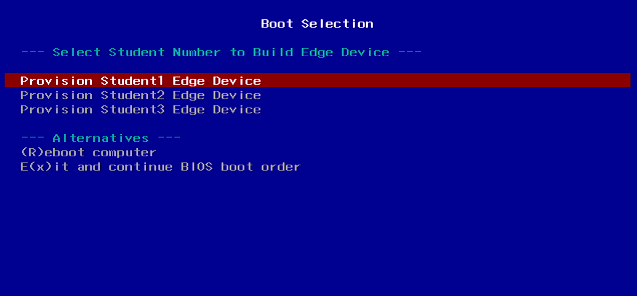

# Section 2 - Automated device onboarding

During this section you need to bear in mind two important things:

* During the device onboarding you will need to see the edge device Console terminal to see the device booting. This terminal is not the SSH terminal but the actual video output of the system. If you are using VMs for your demo/workshop that's not an issue because you can just open the VM's console but if you are using physical servers you will need either an external (big) screen connected to your device or a Video Capture Card (as the one shown in the [Recommended Hardware Section](README.md#recommended-hardware) to show the Console output on your laptop.

* When booting the device prior to the onboarding, since we prepared the lab to provision multiple boot images at the same time (explained later), you will need to select the right image in the PXE boot menu, which means that you need a connected keyboard to your server. Again, this is not a problem if you are using VMs, but if you are using physical devices you will need to have a physical keyboard connected to it, that's the reason why I suggested in the [Recommended Hardware Section](README.md#recommended-hardware) to have a mini-keyboard as part of the demo/workshop setup.

Now it's time to prepare your edge device:

* If you are using a physical device: You will need to configure your BIOS to first boot from network using the interface that is connected to the local edge management server.

* If you plan to use a VM: You will need to create a VM with at least 2vCPUs, 2.5 GB Memory, 10GB disk and 1 NIC connected to the "isolated network" wher you have the secondary interface of your local edge manager server. If you use `Virtual Machine Manager` (so `libvirt`) you should select the `Manual install` mode, then be sure that you select the right network and click `Customize configuration before install` so you can select the boot order in `Boot Options` to use the NIC first (remember than once installed you will need to change this into the local disk by stopping the VM and de-selecting the network boot in this menu). If you are not using  `Virtual Machine Manager` just create an "empty" VM (so no OS installed but with a local disk attached) that boots from NIC and then change the boot order after the install (when you see again the PXE menu page).

1. Open the "Jobs" page in the AAP and keep it visible while performing the following steps.


2. It's time to boot our edge device VM or physical server and perform the onboarding (if you didn't already). You need to boot from network (using the NIC that is connected to the edge local manager internal network). You will need to configure your VM or Physical BIOS to boot from the right interface. If your edge device was already deployed in a previous test or it already has Linux installed on it you can also use `efibootmgr` to select the "Next boot order" from the CLI:

* Check the enabled boot methods with `efibootmgr` command:

```bash
[root@edge-848bcd4d1537 ~]# efibootmgr 
BootCurrent: 0004
Timeout: 3 seconds
BootOrder: 0004,0000,0003,0002,0001
Boot0000* EFI Hard Drive (TS128GMTS952T2)
Boot0001* Internal EFI Shell
Boot0002* EFI PXE 0 for IPv4 (84-8B-CD-4D-15-37) 
Boot0003* EFI PXE 1 for IPv4 (84-8B-CD-40-55-5F) 
Boot0004* Red Hat Enterprise Linux
```

* Select the right NIC to be used in the next boot as first option with `efibootmgr --bootnext <selection>` command:

```bash
[root@edge-848bcd4d1537 ~]# efibootmgr --bootnext 2
BootNext: 0002
BootCurrent: 0004
Timeout: 3 seconds
BootOrder: 0004,0000,0003,0002,0001
Boot0000* EFI Hard Drive (TS128GMTS952T2)
Boot0001* Internal EFI Shell
Boot0002* EFI PXE 0 for IPv4 (84-8B-CD-4D-15-37) 
Boot0003* EFI PXE 1 for IPv4 (84-8B-CD-40-55-5F) 
Boot0004* Red Hat Enterprise Linux

```

* Reboot the system with `systemctl reboot` command


When you system boots from network, you will hit a menu where you will select the image that you will start using PXE boot:



Select the user that you are using for the demo/workshop (probably Student 1).

  >**Note**
  >
  > It's important to say here that in a real production environment there won't be any manual step to select the right image (since we will have just a single image) so you will get a completely unattended onboarding experienc. Here we need to select the image because the lab is prepared to be used by several people at the same time and the PXE server is unique.


3. Wait until the server boots. Few seconds later you will see that two Workflow Jobs are automatically launched in AAP:


* Provision Edge Device: It's a workflow that starts these three Jobs secuentially:

    - "Create Host in Controller Inventory": AAP needs a host created in the inventory to be able to manage it. This job creates two new entries. The first one as part of the "Edge Devices" hosts and the second one as a standalone entry. You can show the configurations made by opening the "Inventories" page in AAP and check the "Hosts" tab in both the `Edge Devices` and the `edge-<system mac address with no : characters>` inventories.

  >**Note**
  >
  > Take note of the edge device IP shown in "Hosts" inside the inventory since you will need it to SSH to it later.

    - "Test Device Connectivity": This is a quick check that the AAP can SSH to the recently added system into the inventory

    - Initial Device Configuration: Here is where the "real" onboarding automation is made. In our example we are only doing one thing with our systems: changing the host name from `localhost` to `edge-<system mac address with no : characters>`

  >**Note**
  >
  > It's a good time here to open the conversation about automating using Kickstarts/FDO VS doing it with EDA+AAP. Any of the automations configured in the kickstart file (less the AAP auto-registration) are suitable to be done by the AAP instead by the Kickstart. Probably for production is better to have it centralized in AAP, but in this demo we included the onboarding automations in a kickstart file since those are easier to explain at first sight. 
  

* Configure Edge Device: It's a workflow with a single Job:

    - Copy config files: Gets the files from `device-edge-configs/OS` in Gitea and copy them into the edge device.


4. The magic behind this automated workflow is that, as explained in [Section 1 - Creating RHEL Images the GitOps way](#section-1---creating-rhel-images-the-gitops-way), the kickstart file crestes an auto-registration Systemd unit and script that is launched on the system first boot. That scripts calls the Event Driven Automation service to start the workflows in AAP. You can now SSH to the edge device and check those script and systemd unit with the following commands as root: 

  >**Note**
  >
  > Your edge device is located in an "isolated" network. If you don't plug your laptop into that network, in order to SSH to the edge device in this demo you will need to first SSH to the local edge manager server and use it as a Jump host. Remember that you have the local edge manager server IP in the `local-inventory.yaml` file that you used to deploy the lab and you can obtain the edge device IP from the AAP Inventory.

The script:

```bash
cat /var/tmp/aap-auto-registration.sh 
#!/bin/bash
conn_name=\$(nmcli con show | grep -v UUID | head -n 1 | awk '{print \$1}')
IP_ADDRESS=\$(nmcli conn show \$conn_name | grep ip_address | awk '{print \$4}')

#MAC_ADDRESS=\$(ip addr | grep wlp -A 1 | grep link | awk '{print \$2}' | sed 's/://g')
MAC_ADDRESS=\$(ip addr | grep \$conn_name -A 1 | grep link | awk '{print \$2}' | sed 's/://g')
STUDENT='1'


if [ -z "\$IP_ADDRESS" ] || [ -z "\$MAC_ADDRESS" ] || [ -z "\$STUDENT" ]; then
    echo "One or more required variables are empty. Script failed."
    exit 1
fi

JSON="{\
\"ip_address\": \"\$IP_ADDRESS\", \
\"student\": \"\$STUDENT\", \
\"mac_address\": \"\$MAC_ADDRESS\" \
}"

/usr/bin/curl -H 'Content-Type: application/json' --data "\$JSON" https://eda.{{ ec2_name_prefix }}.{{ workshop_dns_zone }}/endpoint
```
  >**Note**
  >
  > In the command output you will get something similar but with those `{{ xxx }}` variables substituted with the values that you have in your  `extra_vars.yml` file that you used for the deployment.


The Systemd unit:

```bash
cat /etc/systemd/system/aap-auto-registration.service 
[Unit]
Description=Register to Ansible Automation Platform
After=network.target
After=connect-wifi.service
ConditionPathExists=!/var/tmp/aap-registered

[Service]
Type=simple
ExecStart=/bin/bash -c 'while true; do /var/tmp/aap-auto-registration.sh && /usr/bin/touch /var/tmp/aap-registered && break; done'

[Install]
WantedBy=default.target
```

  >**Note**
  >
  > Please note that for this demo we are not authenticating the EDA requests for simplicity.
  