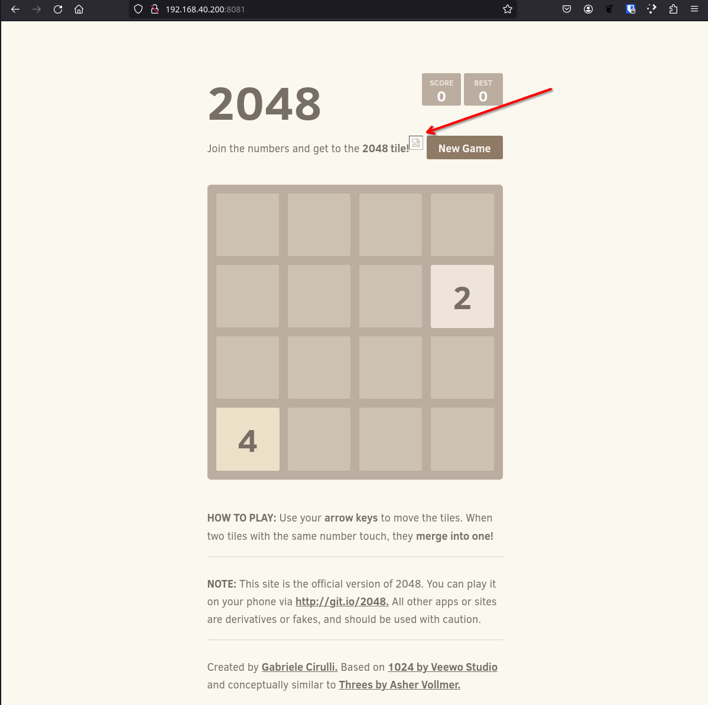
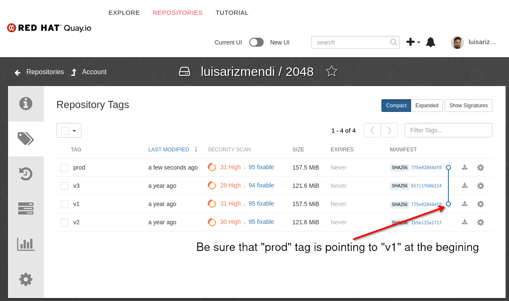
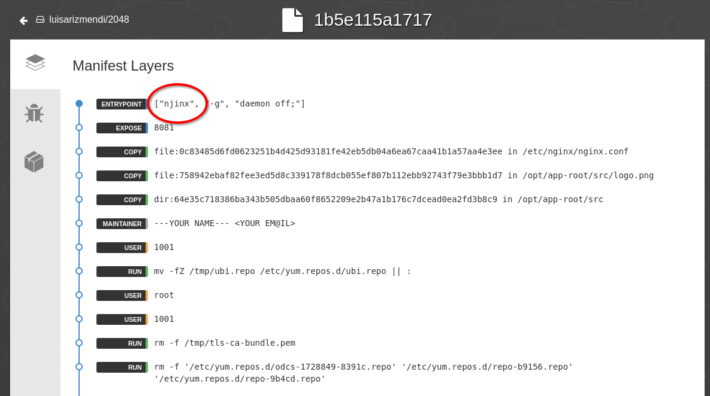

# APPs with Podman and Systemd
In this section we will explore how just using Podman and Systemd we can obtain advanced capabilities without using Kubernetes.

In this first part, we have two test applications already deployed, both as rootless containers, thanks to the `kickstart` file that we prepared during Section 1: One of them is a simple HTTP server, and the other is a web browser game.


## Serverless APP with Podman and Systemd


The "simple HTTP server" is deployed as a Serverless container at the port `8080`, which means that if you take a look at the running containers in the edge device you will only see the web browser game at port `8081` in the edge device:

1. Run `podman ps` in the edge device as the non-root user (probably `ansible` if you didn't change in the lab deployment playbooks)

```bash
[ansible@edge-848bcd4d1537 ~]$ podman ps
CONTAINER ID  IMAGE                            COMMAND     CREATED         STATUS         PORTS                          NAMES
ef90da4894db  quay.io/luisarizmendi/2048:prod              35 minutes ago  Up 35 minutes  <edge device ip>:8081->8081/tcp  app1
```

The Serverless container will be created as soon as a request comes to the port `8080`.  Bear in mind that to prevent starting pulling the container image on the first request, there is a Systemd unit pre-configured in the server that pre-pulls that image, so when you query the Serverless service you get the answer instantaneously, without having to wait to get the Container image ready on the server.

  >**Note**
  >
  > It's a good idea to run `podman image list` as the non-root user to double check that the image (`quay.io/<your registry>/simple-http`) is there and, if not, pull it manually before continuing with the steps below.


At this point, we can query the Serverless service (on port 8080) and we'll see how the new container is launched:

1. Run `watch podman ps` in the edge device as the non-root user. Keep this terminal visible to show how the new container is created automatically.

```bash
watch podman ps
```
2. Open the browser (where the SOCKS proxy is configured) in your laptop and query the Serverless application at `http://<edge device IP>:8080`. You will get a `v1 is working! ` message.

3. Show what happened in the terminal where `watch podman ps` was running. The new container should be created now

```bash
[ansible@edge-848bcd4d1537 ~]$ podman ps
CONTAINER ID  IMAGE                                   COMMAND               CREATED         STATUS         PORTS                          NAMES
ef90da4894db  quay.io/luisarizmendi/2048:prod                               36 minutes ago  Up 36 minutes  <edge device ip>:8081->8081/tcp  app1
823e10fa4a3c  quay.io/luisarizmendi/simple-http:prod  /usr/sbin/nginx -...  35 seconds ago  Up 35 seconds  127.0.0.1:8080->8080/tcp       httpd
```

4. (optional) You could wait 90 seconds and show how the Container is stopped automatically if no new request are made to the service


## Podman container image auto-update

If you create a new version of the container image and push it to the registry, two options exist in order automate the upgrade. You can configure a webhook in the container image registry to start a workflow in Ansible Controller, as we've seen when reviewing the OS configuration, or, as a second option, you can use a Podman feature called `podman auto-update` to check the registry for updates and apply them automatically. In our case we will use the second option.

But beyond just deploying new versions when they are available, we will show how podman auto-update can check if the new version is "ok". If the health-checks are not passed while booting the new version, it will automatically rollback to the previous one. We will demonstrate this by introducing an error in the second version of the image and then fixing it in the third version.

This time we will be using the game app deployed on port `8081` in the edge device, where the Podman auto-update has been configured. Let's see a possible image upgrade workflow:

1. Open the Web Browser where the SOCKS proxy is configured and open the port `8081` on the edge device ip: `http:<edge device ip>:8081`. You will see a 2048 Web Browser game.

  >**Note**
  >
  > Remember to run the [Pre-flight checks](0.1-deployment/README.md#pre-flight-checks) before demo to be sure that the 2048 container image tags are correctly set in `quay.io`.

2. Show a problem with the APP: an embed image is not loading:




3. Now the developer should fix the problem on the app and then `push` the new container image version into the registry. Open `Quay.io` and explain by showing the tags on the 2048 repository that in order to save time what we did is pre-push the new container image in the registry, and we can change from one version to another by just changing where the `prod` tag is pointing to.




4. The `v2` image is the one that the developer created to fix the image problem... but he introduced an additional (big) issue while creating the Containerfile that will make the image not able to boot. He mistyped `nginx` in the Containerfile. You can show this by clicking in quay.io in the "Manifest" while in the "tag" page of the repository (it will show something like "SHA256 1b5e115a1717"):




  >**Note**
  >
  > Even though we know that this image won't boot, we will update the `prod` tag to point to `v2` so we will see two things, first that `podman auto-update` will detect that a new version of the container image is availabe, and second how the self-healing capability of `podman auto-update` rollback to version `v1` because `v2` is not able to boot.


5. Run the `watch 'podman auto-update --dry-run; echo ""; podman ps'` command on the edge device as the non-root user. 

```bash
watch 'podman auto-update --dry-run; echo ""; podman ps'
```
This will show the status of Podman auto-update (if it detects a new version) and the running containers. Keep this terminal visible during the next step.

```bash
Every 2.0s: podman auto-update --dry-run; echo ""; podman ps                                                                       edge-848bcd4d1537: Mon Jan  8 14:58:56 2024

            UNIT                    CONTAINER            IMAGE                            POLICY      UPDATED
            container-app1.service  1ec5693e0e3d (app1)  quay.io/luisarizmendi/2048:prod  registry    false

CONTAINER ID  IMAGE                            COMMAND     CREATED         STATUS         PORTS                          NAMES
1ec5693e0e3d  quay.io/luisarizmendi/2048:prod              34 minutes ago  Up 34 minutes  <edge device ip>:8081->8081/tcp  app1
```


6. Go to the tag page on the 2048 repository in `Quay.io` and click "Add New Tag" on the gearwheel (at the right) for the `v2`image. Create a new tag `prod` (it will say "Move" instead of "Create" because the tag `prod` already exists).


7. Show how the new image is detected ( "UPDATED" changed to `pending`) in CLI Terminal. Then show how the new container is created (check the "CREATED" time that will move to 1 seconds when the image is deployed). Finally show how Podman re-generates a new container version (which in fast is `v1`) as rollback by going again to the APP in `http:<edge device IP>:8081`. You will be able to reach out to the APP because of the rollback (otherwise no APP will be running during the intentionally added issue in the Containerfile of `v2`).

8. Finally go to `quay.io` and move tag `prod` to `v3` where both the image and the Containerfile issues have been solved. You will see how Podman auto-update is able to deploy the new version and if you access the AAP you will see how the image is now loaded. 

  >**Note**
  >
  > If the image does not appear, be sure that you are not caching the page by opening the page in Private/Incognito mode.


## Deploying an APP in Podman in a declarative way

Those APPs were deployed by default as part of the onboarding, but what happens if I need to deploy a specific APP in a specific device? and what If you want to do it in a declarative way? The answer is [Quadlet](https://www.redhat.com/sysadmin/quadlet-podman).

You can create new containerized applications by just putting a descriptor in` /usr/share/containers/systemd/` or `/etc/containers/systemd` (`HOME/.config/containers/systemd/` for rootless containers). During this step we will demo how we can use AAP and EDA to create this kind of APPs in a GitOps way.

There is Job already created to deploy (root) container images based on a file descriptor located in GIT.


1. Open Gitea and show the `device-edge-configs/APPs/podman/quadlet` folder. There will be the descriptors that will be created on the edge devices. You have one preloaded: `app_fuxa_scada.container`. Open that file and show the config (mainly the image and port).

  >**Note**
  >
  > That application needs quite large container images. If you are running the demo/workshop in an environment with low bandwidth you might use any other container image that you know would work better.


2. Here you have two options. First you can go into the AAP and run the Template "Create Quadlet APP" or you can change something (for example, change the port) on the descriptor on Gitea and see how EDA gets the Job launched for you. If you choose the second option remember to open first the "Jobs" page in the AAP so people can see how the Job is auto-launched. 

  >**Note**
  >
  > You can also open a Terminal in the edge device and run `watch podman ps` command as root and keep that CLI visible to check how the new Containers created right after running the AAP Template or changing the file in Gitea.

3. Go to the edge device Terminal and as the root user (this time we deployed a root container in contrast with all the rest of containers that were rootless) check the running containers:

```bash
[root@edge-848bcd4d1537 ~]# podman ps
CONTAINER ID  IMAGE                             COMMAND     CREATED         STATUS         PORTS                   NAMES
a164ed35c012  docker.io/frangoteam/fuxa:latest  npm start   17 seconds ago  Up 17 seconds  0.0.0.0:1882->1882/tcp  systemd-app_fuxa_scada
```

4. Show the APP by visiting `http:<edge device IP>:<configured port>`

5. (Optional) You can go back to Gitea and change something (ie. the port) in the `device-edge-configs/APPs/podman/quadlet/app_fuxa_scada.container` file and see how that change is applied to the application.