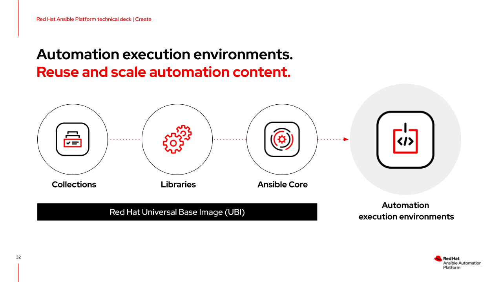

# Workshop Exercise 3.1 - Reviewing Execution Environments

## Table of Contents

* [Objective](#objective)
* [What Is an Execution Environment](#what-is-an-execution-environment)
* [How Execution Environments are Built](#how-execution-environments-are-built)

## Objective

In this exercise, we are going to review what execution environments are and how they're built.

This exercise will cover:

* What an execution environment is
* How execution environments are built


### What Is an Execution Environment


Execution environments are container images that have Ansible components, roles, collections, python libraries, and system dependencies rolled into a single image. They give our automation portability, while providing all the necessary moving parts required to run our automation. Exeuction environments are pulled by Ansible Controller prior to execution of a job template, and then the specifics of the job are fed into it when automation is begun.

Execution environments are built on top of [Red Hat UBIs](https://www.redhat.com/en/blog/introducing-red-hat-universal-base-image).

### How Execution Environments are Built


Ansible Builder is a tool that creates exeuction environments according to a set of definition files. These files contain our requirements for the execution environment: what collections we'd like included, why python libraries are needed, and what system dependencies we'll also need.

For example, here's a simple `execution-environment.yml`:
```yaml
dependencies:
  galaxy: requirements.yml
  python: requirements.txt
  system: bindep.txt
```

This tells Ansible Builder to look for these 3 files, as they contain the content we want to go into our execution environment.

First, our desired collections in `requirements.yml`:
```yaml
collections:
  - name: ansible.utils
  - name: ansible.posix
  - name: infra.osbuild
```

This specifies 3 collections that should be pulled and added to the execution environment.

Next, our python libarary requirements in `requirements.txt`:
```
pyYAML
jsonpatch
```

Ansible Builder will ensure these python libraries are available within the execution environment.

And finally, our system reuqirements in `bindep.txt`:
```
git
```

This list is small, as we won't need many system tools or functions.

Once an execution environment is built, it can be stored it Automation Hub or in any image registry.

For more information on Ansible Builder, check out [this blog post](https://www.ansible.com/blog/introduction-to-ansible-builder) and the official Red Hat documentaion on [Ansible Builder](https://access.redhat.com/documentation/en-us/red_hat_ansible_automation_platform/2.1/html/ansible_builder_guide/index).

---
**Navigation**

[Previous Exercise](../2.2-build-image-webui) | [Next Exercise](../3.2-image-definition-in-code)

[Click here to return to the Workshop Homepage](../README.md)
