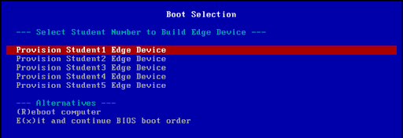
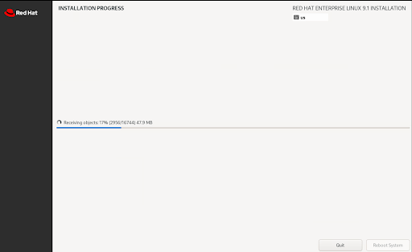

# Workshop Exercise 4.1 - Network Provisioning an Edge Device

## Table of Contents

* [Objective](#objective)
* [Step 1 - Hooking Up Device at an Imaging Station](#step-1---hooking-up-device-at-an-imaging-station)
* [Step 2 - CBooting from the Network](#step-2---booting-from-the-network)
* [Step 3 - Selecting Your Device in the iPXE Menu](#step-3---selecting-your-device-in-the-ipxe-menu)

## Objective

In this exercise, we'll "zero-touch" provision a device from our edge image using network booting.

### Step 1 - Hooking Up Device at an Imaging Station

If you have been issued an edge device, bring the device up to one of the imaging stations located in the workshop room. Your instructor should have pointed them out to you at the beginning of the workshop, however if you have any questions do not hesitate to ask.

At the imaging station, connect the following to your edge device:
- AC power
- Monitor
- USB keyboard
- Ethernet

The imaging stations are simply there for the initial installation of Red Hat Device Edge. Once the process is complete, you may disconnect it from the imaging station and return to your spot in the room.

### Step 2 - Booting from the Network

Once all appropriate connections to the device are made, power up the device. When the splash screen appears, hit the key to enter the boot menu.

> **Note**
>
> For OnLogic devices, the boot menu key is `F10`. For Intel devices (NUCs), the boot menu key is `DEL`.

If you miss the window to enter the boot menu, simply power down the device and restart the process.

Once in the boot menu, select the appropriate NIC to begin the network boot process.

> **Note**
>
> Some devices will have multiple NICs, and thus multiple options for network boot in the boot menu. Your insctructor should be able to tell you which option to use on your specific device, however there's no harm in trying both.

### Step 3 - Selecting Your Device in the iPXE Menu

After selecting the correct option in the boot menu, the device will take a few seconds and perform a [chainload](https://ipxe.org/howto/chainloading). First, pxe is loaded by the device, then ipxe is pulled by pxe and started. Once this process has completed, the iPXE menu will be downloaded and displayed by the device.

On this menu, use the arrow keys to navigate to the correct boot option for your device. For example, if you are `student2`, then select the `Provision Student2 Edge Device` option.

Once you've made your selection, the device will begin the provisioning process. First, it will pull a few files to boot into the installation environment:

Once complete, you should be greeted with the familiar Anaconda installer, which won't require input:

Once the installation is complete, the device will shut down, signifying that it is safe to disconnect from the imaging station.

---
**Navigation**

[Previous Exercise](../3.4-aap-inage-build) | [Next Exercise](../4.2-initial-call-home)

[Click here to return to the Workshop Homepage](../README.md)
