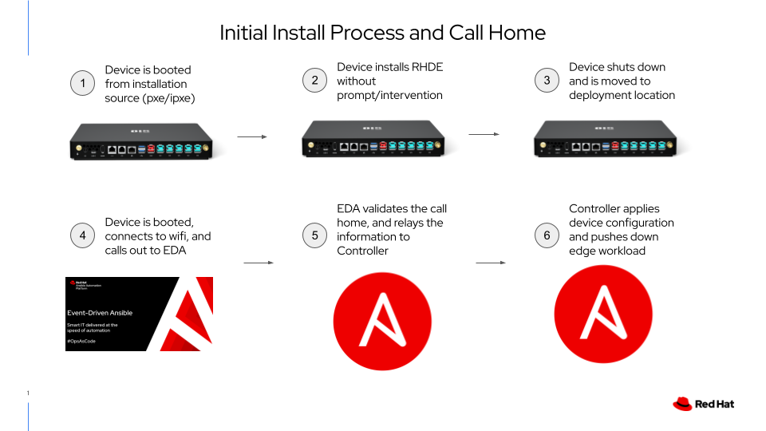
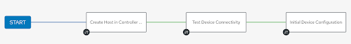
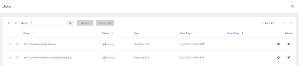

# Workshop Exercise 4.2 - Initial Call Home

## Table of Contents

* [Objective](#objective)
* [Step 1 - Connecting to the Lab WiFi Network](#step-1---connecting-to-the-lab-wifi-network)
* [Step 2 - Handling the Call Home](#step-2---handling-the-call-home)
* [Step 3 - The Workflow in Ansible Controller](#step-3---the-workflow-in-ansible-controller)
* [Solutions](#solutions)

## Objective

In this exercise, we'll investigate what is happening under the covers to enable our zero-touch provisioning.

> **Note**
>
> The steps below are written from the perspective of the device, not steps we as humans need to take. Ideally, these will just happen in the background, and be completed by the time we finish reviewing the steps.


### Step 1 - Connecting to the Lab WiFi Network

The first thing that needs to be handled is connecting to the correct network, in this case the lab wifi network.

As part of the workshop infrastructure, [kickstart files](https://access.redhat.com/documentation/en-us/red_hat_enterprise_linux/9/html-single/performing_an_advanced_rhel_9_installation/index#performing_an_automated_installation_using_kickstart) are generated and placed on a web server. As part of the installation process, the device downloaded the kickstart and run through the steps listed within.

This is an example kickstart for student 1:
```
network --bootproto=dhcp --onboot=true
keyboard --xlayouts='us'
lang en_US.UTF-8
timezone UTC
zerombr
clearpart --all --initlabel
autopart --type=plain --fstype=xfs --nohome
reboot
graphical
user --name=ansible --groups=wheel --password='example-password'
rootpw --plaintext --lock 'example-password'
services --enabled=ostree-remount
ostreesetup --nogpg --url=http://ostree-repo.device-edge.redhat-workshops.com/repo --osname=rhel --ref=rhel/9/x86_64/edge

%post
cat > /etc/systemd/system/connect-wifi.service <<EOF
[Unit]
Description=Connect to lab WiFi
After=network.target
ConditionPathExists=!/var/tmp/wifi-connected

[Service]
Type=oneshot
ExecStartPre=/usr/bin/nmcli radio wifi on
ExecStartPre=/usr/bin/sleep 5
ExecStartPre=/usr/bin/nmcli dev wifi rescan
ExecStartPre=/usr/bin/sleep 5
ExecStartPre=/usr/bin/nmcli dev wifi list
ExecStart=/usr/bin/nmcli dev wifi connect lab-wifi password 'example-password'
ExecStopPost=/usr/bin/touch /var/tmp/wifi-connected

[Install]
WantedBy=default.target
EOF

cat > /var/tmp/aap-auto-registration.sh <<EOF
#!/bin/bash
IP_ADDRESS=\$(nmcli conn show lab-wifi | grep ip_address | awk '{print \$4}')
MAC_ADDRESS=\$(ip addr | grep wlp -A 1 | grep link | awk '{print \$2}' | sed 's/://g')
STUDENT='1'

JSON="{\
\"ip_address\": \"\$IP_ADDRESS\", \
\"student\": \"\$STUDENT\", \
\"mac_address\": \"\$MAC_ADDRESS\" \
}"

/usr/bin/curl -H 'Content-Type: application/json' --data "\$JSON" https://eda.device-edge.redhat-workshops.com/endpoint
EOF

cat > /etc/systemd/system/aap-auto-registration.service <<EOF
[Unit]
Description=Register to Ansible Automation Platform
After=network.target
After=connect-wifi.service
ConditionPathExists=!/var/tmp/aap-registered

[Service]
Type=oneshot
ExecStart=/bin/bash /var/tmp/aap-auto-registration.sh
ExecStopPost=/usr/bin/touch /var/tmp/aap-registered

[Install]
WantedBy=default.target
EOF

systemctl daemon-reload
systemctl enable connect-wifi.service
systemctl enable aap-auto-registration.service

%end
```

This kickstart's main section is fairly standard, with the exception of this line:
```
ostreesetup --nogpg --url=http://ostree-repo.device-edge.redhat-workshops.com/repo --osname=rhel --ref=rhel/9/x86_64/edge
```

This is the line that uses ostree to install the ostree image to the system, as opposed to the more traditional setup of Red Hat Enterprise Linux.

Next, three files are deployed to the system:
1. A systemd unit file to connect to the lab wifi network via `nmcli`
2. A simple bash script to gather system information and to run the call home
3. A systemd unit file to run that bash script after a network connection is established

These tree files are deployed to the system, then enabled for run at the next boot.

### Step 2 - Handling the Call Home



After booting the device back up, the WiFi connection is established, and the call home is made. This is caught by [Event Driven Ansible](https://www.ansible.com/blog/getting-started-with-event-driven-ansible) and ferried over to Ansible Controller.

For example, here's the rulebook for the workshop, which instructs EDA on how to handle incoming requests:
```yaml
---
- name: Listen for events on a webhook
  hosts: all

  sources:
    - ansible.eda.webhook:
        host: 0.0.0.0
        port: 5000

  rules:
    - name: Trigger provisioning workflow
      condition: event.payload.ip_address is defined and event.payload.mac_address is defined and event.payload.student is defined

      action:
        run_playbook:
          name: run-workflow.yml
          extra_vars:
            ip_address: "{{ event.payload.ip_address }}"
            student: "{{ event.payload.student }}"
            mac_address: "{{ event.payload.mac_address }}"
```

This roughly translates into "if a web call is made to port 5000, and has a student number, ip address, and mac address, it's an edge device". The action is to run a playbook locally that triggers a workflow run in Ansible Controller.

### Step 3 - The Workflow in Ansible Controller



Once EDA hands the call home information over to Ansible Controller, a workflow is launched that has three nodes to accomplish the following:
1. Create a host in the correct inventory on Controller
2. Test connectivity to the device
3. Perform some initial configuration of the device, such as setting hostname, etc

Ansible Controller will handle the flow via a workflow. The first job runs against "itself", communicating only with the Controller API, then switching context to communicate with the newly provisioned edge device.

### Solutions

Should the process have succeeded, you should be able to view the new host that corresponds to your edge device in **Inventories** > **Edge Devices**. Under the variables section, the device's IP address should be listed as the value to the `ansible_host` key.

In addition, there should be some completed jobs on the **Jobs** tab.



---
**Navigation**

[Previous Exercise](../4.1-network-provision) | [Next Exercise](../5.1-fixme)

[Click here to return to the Workshop Homepage](../README.md)
