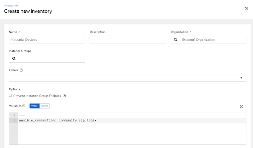
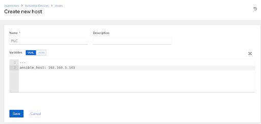

# Workshop Exercise 6.2 - Adding an Inventory for CIP Devices

## Table of Contents

* [Objective](#objective)
* [Step 1 - Creating an Inventory](#step-1---creating-an-inventory)
* [Step 2 - Adding a Host to the Inventory](#step-2---adding-a-host-to-the-inventory)
* [Solutions](#solutions)

## Objective

In this exercise, we'll take a look at CIP and the community.cip Ansible collection.

### Step 1 - Creating an Inventory

Return to the Ansible Controller WebUI and navigate to the **Inventories** page under **Resources**. Select the **Add** button and choose the **Add inventory** option in the dropdown menu.

Enter the following information:

<table>
  <tr>
    <th>Parameter</th>
    <th>Value</th>
  </tr>
  <tr>
    <td>Name</td>
    <td>Industrial Devices</td>
  </tr>
  <tr>
    <td>Organization</td>
    <td>Student$(your-student-number) Organization</td>
  </tr>
  <tr>
    <td>Variables</td>
    <td>`ansible_connection: community.cip.logix`</td>
  </tr>
</table>

When finished, click the **Save** button.

With this inventory created, any device added will inherit the `ansible_connection` variable, meaning Ansible will attempt to connect using the `community.cip.logix` connection plugin instead of the standard ssh or winrm.

### Step 2 - Adding a Host to the Inventory

Still in the web interface of Ansible Controller, navigate to **Inventories** > **Industrial Devices**, and select the **Hosts** tab. Click on the **Add** button and enter the following information:

<table>
  <tr>
    <th>Parameter</th>
    <th>Value</th>
  </tr>
  <tr>
    <td>Name</td>
    <td>PLC</td>
  </tr>
  <tr>
    <td>Variables</td>
    <td>`ansible_host: 192.168.1.141`</td>
  </tr>
</table>

When finished, click the **Save** button.

We now have an industrial device ready to automate against.

### Solutions

---
**Navigation**

[Previous Exercise](../6.1-cip-intro) | [Next Exercise](../6.3-tags-playbook)

[Click here to return to the Workshop Homepage](../README.md)

